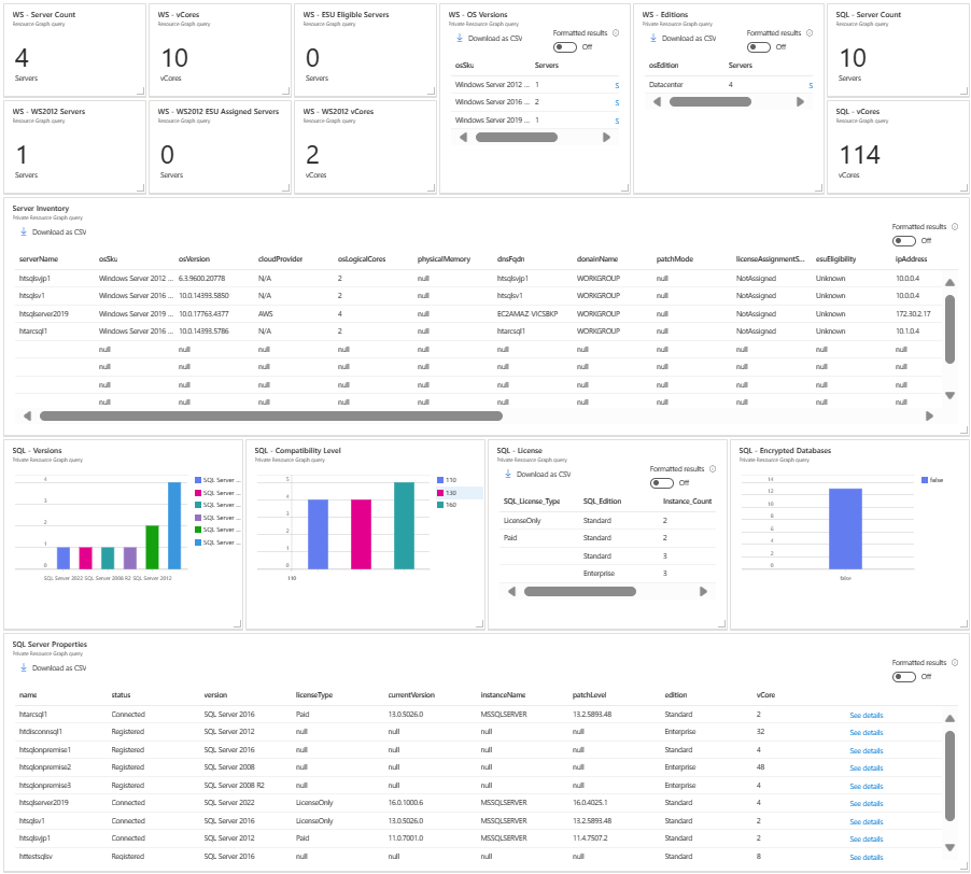

# Sample dashboard for Azure Arc-enabled Server & SQL Server

his sample dashboard enables you to easily manage your Azure Arc-enabled Server and SQL Server inventory.

It includes:

- Number of Windows Servers & SQL Servers
- SKU of Windows Servers & SQL Servers
- Windows Server 2012 ESU status
- Edition of Windows Servers & SQL Servers
- Detailed inventory
  - Versions of Windows Server & SQL Server
  - Patch level
  - Number of CPU cores
  - Cloud Providers per server 
- SQL Server License Type
- SQL Server Compatibility Levels
- Number of encrypted databases

## How to install the dashboard

1. Download "azure-arc-enabled-server-inventory.json" file from this repository
2. Go to https://portal.azure.com
3. Ensure that you can access to the subscription that has Azure Arc-enabled Servers and SQL Servers
4. Go to dashboard, click "Upload", select "azure-arc-enabled-server-inventory.json"

